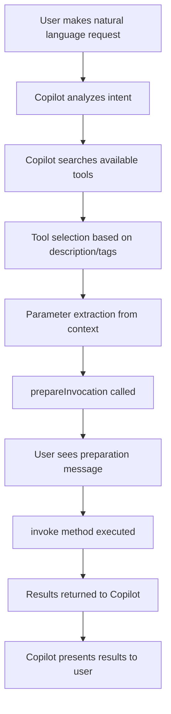

# 🤖 Building Copilot Agent Tools: Complete Developer Guide

A comprehensive guide to creating VS Code extensions that work as Language Model Tools for GitHub Copilot Agent Mode.

## Table of Contents

- [Overview](#overview)
- [Core Concepts](#core-concepts)
- [API Reference](#api-reference)
- [Implementation Workflow](#implementation-workflow)
- [Tool Design Patterns](#tool-design-patterns)
- [Advanced Features](#advanced-features)
- [Testing & Debugging](#testing--debugging)
- [Best Practices](#best-practices)
- [Sample Code Reference](#sample-code-reference)
- [Troubleshooting](#troubleshooting)

---

## Overview

### What are Copilot Agent Tools?

**Language Model Tools** are VS Code extensions that register functions which GitHub Copilot can automatically discover, select, and execute when operating in agent mode. Unlike traditional chat participants that require explicit `@participant` invocation, tools are **automatically chosen** by Copilot based on user intent and natural language requests.

### Key Benefits

✅ **Automatic Selection** - Copilot chooses the right tool based on user intent  
✅ **Natural Language Interface** - Users don't need to learn specific commands  
✅ **Parameter Intelligence** - Copilot configures tools based on context  
✅ **Tool Chaining** - Multiple tools can be used in sequence  
✅ **Seamless Integration** - Works within Copilot's existing workflow  

---

## Core Concepts

### 1. Language Model vs Chat Participant

| Aspect | Chat Participant | Language Model Tool |
|--------|------------------|-------------------|
| **Invocation** | Explicit `@participant` | Automatic by Copilot |
| **Discovery** | User must know command | Copilot discovers automatically |
| **Parameters** | Manual input | Intelligent extraction from context |
| **Usage** | Direct user interaction | Copilot-mediated interaction |
| **Intent** | Command-based | Natural language based |

### 2. Tool Lifecycle



### 3. Tool Registration Architecture

```typescript
// 1. Package.json Declaration
"contributes": {
  "languageModelTools": [
    {
      "name": "tool-identifier",
      "displayName": "Human-readable name",
      "modelDescription": "Description for Copilot to understand tool purpose"
    }
  ]
}

// 2. Runtime Registration
const tool = vscode.lm.registerTool('tool-identifier', {
  invoke: async (options, token) => { /* Implementation */ },
  prepareInvocation: async (options, token) => { /* Optional preparation */ }
});

// 3. Tool Discovery
vscode.lm.tools // Array of all registered tools
```

---

## API Reference

### Core APIs

#### `vscode.lm.registerTool()`

**Purpose**: Register a tool that Copilot can discover and use.

```typescript
function registerTool<T = any>(
  name: string, 
  tool: LanguageModelTool<T>
): Disposable
```

**Parameters**:
- `name`: Must match the name in `package.json` `languageModelTools`
- `tool`: Implementation object with `invoke` and optional `prepareInvocation`

**Example**:
```typescript
const tool = vscode.lm.registerTool('my-demo-tool', {
  invoke: async (options, token) => {
    // Main tool logic here
    return new vscode.LanguageModelToolResult([
      new vscode.LanguageModelTextPart("Tool output")
    ]);
  },
  prepareInvocation: async (options, token) => {
    // Optional: customize progress message
    return {
      invocationMessage: "Executing my demo tool..."
    };
  }
});
```

#### `LanguageModelTool<T>` Interface

```typescript
interface LanguageModelTool<T = any> {
  invoke(
    options: LanguageModelToolInvocationOptions<T>, 
    token: CancellationToken
  ): ProviderResult<LanguageModelToolResult>;
  
  prepareInvocation?(
    options: LanguageModelToolInvocationPrepareOptions<T>, 
    token: CancellationToken
  ): ProviderResult<PreparedToolInvocation>;
}
```

### Key Types

#### `LanguageModelToolInvocationOptions<T>`

```typescript
interface LanguageModelToolInvocationOptions<T> {
  readonly input: T;           // Parameters extracted by Copilot
  readonly tokenBudget: number; // Available tokens for response
  readonly context: LanguageModelChatContext; // Conversation context
}
```

#### `LanguageModelToolResult`

```typescript
class LanguageModelToolResult {
  constructor(content: LanguageModelTextPart[]);
}

class LanguageModelTextPart {
  constructor(value: string);
}
```

#### `PreparedToolInvocation`

```typescript
interface PreparedToolInvocation {
  invocationMessage?: string;  // Custom progress message
  confirmationMessages?: {     // Optional confirmation dialog
    title: string;
    message: string;
  };
}
```

### Package.json Configuration

#### `languageModelTools` Contribution Point

```json
{
  "contributes": {
    "languageModelTools": [
      {
        "name": "unique-tool-identifier",
        "displayName": "Display Name for Users",
        "modelDescription": "Detailed description for Copilot's understanding",
        "tags": ["optional", "categorization", "tags"]
      }
    ]
  }
}
```

**Field Details**:
- `name`: **Required** - Unique identifier, used in `registerTool()`
- `displayName`: **Required** - Human-readable name shown in UI
- `modelDescription`: **Required** - Detailed description for Copilot's tool selection
- `tags`: **Optional** - Array of strings for categorization and filtering

---

## Implementation Workflow

### Step 1: Package.json Setup

First, declare your tools in the extension manifest:

```json
{
  "name": "my-copilot-extension",
  "contributes": {
    "languageModelTools": [
      {
        "name": "file-processor",
        "displayName": "File Processor",
        "modelDescription": "Processes multiple files with progress tracking and supports various file types including JavaScript, TypeScript, JSON, and Markdown"
      },
      {
        "name": "workspace-analyzer", 
        "displayName": "Workspace Analyzer",
        "modelDescription": "Analyzes VS Code workspace structure, discovers files, and provides insights about project configuration and file organization"
      }
    ]
  }
}
```

### Step 2: Tool Registration in Extension

In your `activate()` function:

```typescript
export function activate(context: vscode.ExtensionContext) {
  // Register each tool
  const fileProcessor = vscode.lm.registerTool('file-processor', {
    invoke: async (options, token) => {
      const input = options.input as {
        fileCount?: number;
        fileTypes?: string[];
        processingTime?: number;
      };
      
      // Implement tool logic
      return new vscode.LanguageModelToolResult([
        new vscode.LanguageModelTextPart("Processing complete!")
      ]);
    },
    
    prepareInvocation: async (options, token) => {
      const input = options.input as { fileCount?: number };
      return {
        invocationMessage: `Processing ${input.fileCount || 'multiple'} files...`
      };
    }
  });
  
  // Add to subscriptions for proper cleanup
  context.subscriptions.push(fileProcessor);
}
```

### Step 3: Input Type Definition

Define TypeScript interfaces for your tool inputs:

```typescript
interface FileProcessorInput {
  fileCount?: number;
  fileTypes?: string[];
  processingTime?: number;
  showProgress?: boolean;
}

interface WorkspaceAnalyzerInput {
  deep?: boolean;
  includeHidden?: boolean;
  fileTypes?: string[];
  excludePatterns?: string[];
}
```

### Step 4: Tool Implementation

#### Basic Tool Structure

```typescript
const tool = vscode.lm.registerTool('tool-name', {
  invoke: async (options, token) => {
    // 1. Extract and validate input
    const input = options.input as YourInputType;
    
    // 2. Implement tool logic with progress tracking
    let result = "Starting operation...\n\n";
    
    try {
      // 3. Check for cancellation periodically
      if (token.isCancellationRequested) {
        result += "❌ Operation cancelled by user";
        return new vscode.LanguageModelToolResult([
          new vscode.LanguageModelTextPart(result)
        ]);
      }
      
      // 4. Perform main operations
      result += "✅ Operation completed successfully!";
      
    } catch (error) {
      // 5. Handle errors gracefully
      result += `❌ Error: ${error instanceof Error ? error.message : 'Unknown error'}`;
    }
    
    // 6. Return formatted result
    return new vscode.LanguageModelToolResult([
      new vscode.LanguageModelTextPart(result)
    ]);
  },
  
  prepareInvocation: async (options, token) => {
    // Customize the progress message shown during tool execution
    const input = options.input as YourInputType;
    return {
      invocationMessage: `Executing tool with parameter: ${input.someParam}`
    };
  }
});
```

---

## Tool Design Patterns

### 1. Progress Tracking Pattern

For long-running operations, provide detailed progress updates:

```typescript
invoke: async (options, token) => {
  const input = options.input as { steps?: number };
  const steps = input.steps || 5;
  let result = `Starting ${steps}-step process...\n\n`;
  
  for (let i = 1; i <= steps; i++) {
    // Check cancellation before each step
    if (token.isCancellationRequested) {
      result += `❌ Cancelled at step ${i}`;
      break;
    }
    
    result += `📋 Step ${i}/${steps}: Processing...\n`;
    
    // Simulate work
    await new Promise(resolve => setTimeout(resolve, 1000));
    
    result += `✅ Step ${i} completed\n\n`;
  }
  
  if (!token.isCancellationRequested) {
    result += `🎉 All ${steps} steps completed successfully!`;
  }
  
  return new vscode.LanguageModelToolResult([
    new vscode.LanguageModelTextPart(result)
  ]);
}
```

### 2. Workspace Integration Pattern

For tools that interact with the VS Code workspace:

```typescript
invoke: async (options, token) => {
  const input = options.input as { fileTypes?: string[] };
  let result = "🔍 Analyzing workspace...\n\n";
  
  try {
    // Get workspace folders
    const workspaceFolders = vscode.workspace.workspaceFolders;
    if (!workspaceFolders || workspaceFolders.length === 0) {
      result += "⚠️ No workspace folder found";
      return new vscode.LanguageModelToolResult([
        new vscode.LanguageModelTextPart(result)
      ]);
    }
    
    // Search for files
    const pattern = input.fileTypes 
      ? `**/*.{${input.fileTypes.map(t => t.replace('.', '')).join(',')}}`
      : '**/*';
      
    const files = await vscode.workspace.findFiles(
      pattern,
      '**/node_modules/**',
      100
    );
    
    result += `📊 Found ${files.length} files\n`;
    
    // Group by file type
    const filesByType: Record<string, number> = {};
    files.forEach(file => {
      const ext = file.path.split('.').pop() || 'no-extension';
      filesByType[ext] = (filesByType[ext] || 0) + 1;
    });
    
    result += "\n📈 File breakdown:\n";
    Object.entries(filesByType)
      .sort(([,a], [,b]) => b - a)
      .forEach(([ext, count]) => {
        result += `  • .${ext}: ${count} files\n`;
      });
    
  } catch (error) {
    result += `❌ Error analyzing workspace: ${error}`;
  }
  
  return new vscode.LanguageModelToolResult([
    new vscode.LanguageModelTextPart(result)
  ]);
}
```

### 3. Configuration-Based Pattern

For tools with multiple configuration options:

```typescript
interface ConfigurableToolInput {
  mode?: 'quick' | 'thorough' | 'custom';
  options?: {
    timeout?: number;
    retries?: number;
    verboseOutput?: boolean;
  };
  customSettings?: Record<string, any>;
}

invoke: async (options, token) => {
  const input = options.input as ConfigurableToolInput;
  
  // Set defaults based on mode
  const config = {
    timeout: 5000,
    retries: 3,
    verboseOutput: false,
    ...getDefaultsForMode(input.mode || 'quick'),
    ...input.options,
    ...input.customSettings
  };
  
  let result = `🔧 Running in ${input.mode || 'quick'} mode\n\n`;
  
  if (config.verboseOutput) {
    result += `Configuration:\n${JSON.stringify(config, null, 2)}\n\n`;
  }
  
  // Use configuration throughout tool execution
  // ...
  
  return new vscode.LanguageModelToolResult([
    new vscode.LanguageModelTextPart(result)
  ]);
}

function getDefaultsForMode(mode: string) {
  switch (mode) {
    case 'quick':
      return { timeout: 2000, retries: 1, verboseOutput: false };
    case 'thorough':
      return { timeout: 10000, retries: 5, verboseOutput: true };
    case 'custom':
      return {};
    default:
      return { timeout: 5000, retries: 3, verboseOutput: false };
  }
}
```

### 4. Error Handling Pattern

Robust error handling with user-friendly messages:

```typescript
invoke: async (options, token) => {
  const input = options.input as YourInputType;
  let result = "Starting operation...\n\n";
  
  try {
    // Validate input
    if (!input || typeof input !== 'object') {
      throw new Error('Invalid input provided');
    }
    
    // Check required parameters
    if (input.requiredParam === undefined) {
      throw new Error('Missing required parameter: requiredParam');
    }
    
    // Main operation with multiple try-catch blocks
    try {
      result += await performMainOperation(input, token);
    } catch (operationError) {
      // Handle specific operation errors
      result += `⚠️ Operation warning: ${operationError}\n`;
      result += "Attempting recovery...\n";
      
      try {
        result += await performRecovery(input, token);
      } catch (recoveryError) {
        throw new Error(`Recovery failed: ${recoveryError}`);
      }
    }
    
    result += "\n✅ Operation completed successfully!";
    
  } catch (error) {
    // Final error handling
    const errorMessage = error instanceof Error ? error.message : 'Unknown error';
    result += `\n❌ **Error**: ${errorMessage}\n\n`;
    result += "**Troubleshooting suggestions:**\n";
    result += "- Check your input parameters\n";
    result += "- Ensure workspace is properly configured\n";
    result += "- Try running the operation again\n";
    
    // Still return a result, don't throw
    return new vscode.LanguageModelToolResult([
      new vscode.LanguageModelTextPart(result)
    ]);
  }
  
  return new vscode.LanguageModelToolResult([
    new vscode.LanguageModelTextPart(result)
  ]);
}
```

---

## Advanced Features

### 1. Tool Chaining and Context

Tools can access conversation context to work together:

```typescript
invoke: async (options, token) => {
  const input = options.input as YourInputType;
  const context = options.context;
  
  let result = "🔗 Analyzing conversation context...\n\n";
  
  // Access previous messages
  const previousMessages = context.history;
  const recentToolResults = previousMessages
    .filter(msg => msg instanceof vscode.ChatResponseTurn)
    .slice(-3) // Last 3 responses
    .map(msg => (msg as vscode.ChatResponseTurn).response);
  
  if (recentToolResults.length > 0) {
    result += "📋 Found previous tool results:\n";
    recentToolResults.forEach((response, index) => {
      result += `  ${index + 1}. ${response.substring(0, 50)}...\n`;
    });
    result += "\n";
  }
  
  // Use context to inform current operation
  if (previousMessages.some(msg => msg.prompt?.includes('file'))) {
    result += "🔍 Previous context suggests file operations\n";
    // Adjust behavior based on context
  }
  
  return new vscode.LanguageModelToolResult([
    new vscode.LanguageModelTextPart(result)
  ]);
}
```

### 2. Dynamic Tool Behavior

Adapt tool behavior based on workspace and user context:

```typescript
invoke: async (options, token) => {
  const input = options.input as YourInputType;
  let result = "🎯 Adapting to current context...\n\n";
  
  // Detect project type
  const projectType = await detectProjectType();
  result += `📂 Detected project type: ${projectType}\n`;
  
  // Adapt behavior based on project type
  switch (projectType) {
    case 'typescript':
      result += await handleTypeScriptProject(input, token);
      break;
    case 'python':
      result += await handlePythonProject(input, token);
      break;
    case 'react':
      result += await handleReactProject(input, token);
      break;
    default:
      result += await handleGenericProject(input, token);
  }
  
  return new vscode.LanguageModelToolResult([
    new vscode.LanguageModelTextPart(result)
  ]);
}

async function detectProjectType(): Promise<string> {
  const packageJson = await vscode.workspace.findFiles('**/package.json', null, 1);
  const tsconfig = await vscode.workspace.findFiles('**/tsconfig.json', null, 1);
  const requirements = await vscode.workspace.findFiles('**/requirements.txt', null, 1);
  
  if (tsconfig.length > 0) return 'typescript';
  if (requirements.length > 0) return 'python';
  if (packageJson.length > 0) {
    // Check package.json for React
    try {
      const content = await vscode.workspace.fs.readFile(packageJson[0]);
      const pkg = JSON.parse(content.toString());
      if (pkg.dependencies?.react || pkg.devDependencies?.react) {
        return 'react';
      }
    } catch {}
    return 'nodejs';
  }
  
  return 'unknown';
}
```

### 3. Tool Discovery and Metadata

Help users understand available tools:

```typescript
// Special tool for discovering other tools
const discoveryTool = vscode.lm.registerTool('tool-discovery', {
  invoke: async (options, token) => {
    let result = "🛠️ Available Tools Discovery\n\n";
    
    // List all available tools
    const availableTools = vscode.lm.tools;
    
    result += `Found ${availableTools.length} available tools:\n\n`;
    
    availableTools.forEach((tool, index) => {
      result += `${index + 1}. **${tool.name}**\n`;
      result += `   📋 Description: ${tool.description}\n`;
      if (tool.tags && tool.tags.length > 0) {
        result += `   🏷️ Tags: ${tool.tags.join(', ')}\n`;
      }
      result += `   📊 Input Schema: ${tool.inputSchema ? 'Defined' : 'None'}\n\n`;
    });
    
    result += "💡 **Usage Tips:**\n";
    result += "- Tools are automatically selected by Copilot based on your request\n";
    result += "- Use natural language to describe what you want to accomplish\n";
    result += "- Tools can be chained together for complex workflows\n";
    
    return new vscode.LanguageModelToolResult([
      new vscode.LanguageModelTextPart(result)
    ]);
  }
});
```

---

## Testing & Debugging

### 1. Tool Registration Verification

```typescript
// Check if tools are registered correctly
export function verifyToolRegistration() {
  console.log('=== Tool Registration Verification ===');
  
  const allTools = vscode.lm.tools;
  console.log(`Total registered tools: ${allTools.length}`);
  
  allTools.forEach(tool => {
    console.log(`Tool: ${tool.name}`);
    console.log(`  Description: ${tool.description}`);
    console.log(`  Tags: ${tool.tags?.join(', ') || 'None'}`);
    console.log(`  Input Schema: ${tool.inputSchema ? 'Present' : 'Missing'}`);
  });
  
  // Check for your specific tools
  const yourTools = ['progress-demo-simple', 'progress-demo-file-processor'];
  yourTools.forEach(toolName => {
    const found = allTools.find(t => t.name === toolName);
    console.log(`${toolName}: ${found ? '✅ Found' : '❌ Missing'}`);
  });
}
```

### 2. Manual Tool Testing

```typescript
// Test tools manually during development
export async function testTool(toolName: string, input: any) {
  console.log(`=== Testing Tool: ${toolName} ===`);
  
  try {
    const result = await vscode.lm.invokeTool(toolName, {
      input,
      tokenBudget: 4000,
      context: {} as any
    }, new vscode.CancellationTokenSource().token);
    
    console.log('Tool execution successful:');
    console.log(result.content.map(part => part.value).join('\n'));
    
  } catch (error) {
    console.error('Tool execution failed:', error);
  }
}

// Usage in activate() function for testing
// testTool('progress-demo-simple', { steps: 3, duration: 2000 });
```

### 3. Debug Logging Pattern

```typescript
const DEBUG = process.env.NODE_ENV === 'development';

function debugLog(message: string, data?: any) {
  if (DEBUG) {
    console.log(`[DEBUG] ${message}`, data || '');
  }
}

invoke: async (options, token) => {
  debugLog('Tool invoked', { 
    input: options.input, 
    tokenBudget: options.tokenBudget 
  });
  
  const input = options.input as YourInputType;
  
  try {
    debugLog('Starting main operation');
    const result = await performOperation(input, token);
    debugLog('Operation completed successfully');
    
    return new vscode.LanguageModelToolResult([
      new vscode.LanguageModelTextPart(result)
    ]);
    
  } catch (error) {
    debugLog('Tool execution error', error);
    throw error;
  }
}
```

---

## Best Practices

### 1. Tool Design Guidelines

#### Clear and Descriptive Names
```typescript
// ❌ Bad
"langModelTools": [{ "name": "tool1" }]

// ✅ Good  
"langModelTools": [{ "name": "workspace-file-analyzer" }]
```

#### Comprehensive Model Descriptions
```typescript
// ❌ Bad
"modelDescription": "Processes files"

// ✅ Good
"modelDescription": "Analyzes workspace files by type, size, and modification date. Supports filtering by file extensions, provides detailed statistics, and can process large directories efficiently with progress tracking."
```

#### Meaningful Tags
```typescript
// ✅ Good
"tags": ["file-system", "analysis", "workspace", "statistics"]
```

### 2. Input Validation

```typescript
function validateInput<T>(input: unknown, schema: InputSchema<T>): T {
  if (!input || typeof input !== 'object') {
    throw new Error('Input must be an object');
  }
  
  const validatedInput = input as Record<string, unknown>;
  const result: Partial<T> = {};
  
  for (const [key, config] of Object.entries(schema)) {
    const value = validatedInput[key];
    
    if (config.required && value === undefined) {
      throw new Error(`Missing required parameter: ${key}`);
    }
    
    if (value !== undefined) {
      if (config.type === 'number' && typeof value !== 'number') {
        throw new Error(`Parameter ${key} must be a number`);
      }
      if (config.type === 'string' && typeof value !== 'string') {
        throw new Error(`Parameter ${key} must be a string`);
      }
      if (config.type === 'array' && !Array.isArray(value)) {
        throw new Error(`Parameter ${key} must be an array`);
      }
      
      (result as any)[key] = value;
    } else if (config.default !== undefined) {
      (result as any)[key] = config.default;
    }
  }
  
  return result as T;
}

// Usage
interface FileProcessorInput {
  fileCount: number;
  fileTypes?: string[];
  showProgress?: boolean;
}

const schema = {
  fileCount: { type: 'number', required: true },
  fileTypes: { type: 'array', default: ['.js', '.ts'] },
  showProgress: { type: 'boolean', default: true }
};

invoke: async (options, token) => {
  const input = validateInput<FileProcessorInput>(options.input, schema);
  // Now input is properly typed and validated
}
```

### 3. Output Formatting

```typescript
class OutputFormatter {
  private sections: string[] = [];
  
  addHeader(title: string, level: number = 1): this {
    const prefix = '#'.repeat(level);
    this.sections.push(`${prefix} ${title}\n`);
    return this;
  }
  
  addProgress(message: string, step?: number, total?: number): this {
    const stepInfo = step && total ? ` (${step}/${total})` : '';
    this.sections.push(`🔄 ${message}${stepInfo}\n`);
    return this;
  }
  
  addSuccess(message: string): this {
    this.sections.push(`✅ ${message}\n`);
    return this;
  }
  
  addError(message: string): this {
    this.sections.push(`❌ **Error**: ${message}\n`);
    return this;
  }
  
  addList(items: string[], ordered: boolean = false): this {
    items.forEach((item, index) => {
      const prefix = ordered ? `${index + 1}.` : '-';
      this.sections.push(`${prefix} ${item}\n`);
    });
    this.sections.push('\n');
    return this;
  }
  
  addCodeBlock(code: string, language: string = ''): this {
    this.sections.push(`\`\`\`${language}\n${code}\n\`\`\`\n\n`);
    return this;
  }
  
  toString(): string {
    return this.sections.join('');
  }
}

// Usage
invoke: async (options, token) => {
  const formatter = new OutputFormatter();
  
  formatter
    .addHeader('File Processing Results')
    .addProgress('Starting file analysis...')
    .addSuccess('Found 15 TypeScript files')
    .addList(['file1.ts', 'file2.ts', 'file3.ts'])
    .addCodeBlock('console.log("Hello World");', 'typescript');
  
  return new vscode.LanguageModelToolResult([
    new vscode.LanguageModelTextPart(formatter.toString())
  ]);
}
```

### 4. Performance Optimization

```typescript
// Use efficient file operations
async function getWorkspaceFiles(patterns: string[]): Promise<vscode.Uri[]> {
  // Batch multiple patterns into single search
  const combinedPattern = patterns.length > 1 
    ? `**/*.{${patterns.map(p => p.replace('.', '')).join(',')}}`
    : patterns[0];
    
  return vscode.workspace.findFiles(
    combinedPattern,
    '**/node_modules/**',
    1000 // Reasonable limit
  );
}

// Implement cancellation properly
async function processWithCancellation<T>(
  items: T[],
  processor: (item: T) => Promise<string>,
  token: vscode.CancellationToken
): Promise<string[]> {
  const results: string[] = [];
  
  for (let i = 0; i < items.length; i++) {
    if (token.isCancellationRequested) {
      throw new Error('Operation cancelled');
    }
    
    try {
      const result = await processor(items[i]);
      results.push(result);
    } catch (error) {
      results.push(`Error processing item ${i}: ${error}`);
    }
    
    // Yield control periodically
    if (i % 10 === 0) {
      await new Promise(resolve => setImmediate(resolve));
    }
  }
  
  return results;
}
```

---

## Sample Code Reference

### 1. Where to Find Examples in This Project

#### Main Tool Registration
**File**: `src/extension.ts` (lines 288-665)
- Complete tool registration examples
- All 5 tool implementations with different patterns
- Error handling and cancellation support

#### Package.json Configuration  
**File**: `package.json` (lines 27-47)
- Proper `languageModelTools` contribution point
- Tool metadata and descriptions

#### Key Implementation Patterns

1. **Simple Progress Tool** (`src/extension.ts`, lines 289-321)
   ```typescript
   // Demonstrates basic tool structure with progress tracking
   const simpleProgressTool = vscode.lm.registerTool('progress-demo-simple', {
     invoke: async (options, token) => { /* ... */ },
     prepareInvocation: async (options, token) => { /* ... */ }
   });
   ```

2. **File Processing Tool** (`src/extension.ts`, lines 323-382)
   ```typescript
   // Shows input validation and file simulation
   const fileProcessorTool = vscode.lm.registerTool('progress-demo-file-processor', {
     // Comprehensive input handling and progress tracking
   });
   ```

3. **Workspace Integration Tool** (`src/extension.ts`, lines 384-503)
   ```typescript
   // Demonstrates real VS Code workspace interaction
   const workspaceAnalyzerTool = vscode.lm.registerTool('progress-demo-workspace-analyzer', {
     // Real file system operations with error handling
   });
   ```

4. **Multi-Phase Tool** (`src/extension.ts`, lines 505-595)
   ```typescript
   // Complex workflow with multiple phases and sub-steps
   const taskRunnerTool = vscode.lm.registerTool('progress-demo-task-runner', {
     // Advanced progress tracking with dynamic content
   });
   ```

5. **Interactive Tool** (`src/extension.ts`, lines 597-665)
   ```typescript
   // Simulates user interaction and choices
   const interactiveWizardTool = vscode.lm.registerTool('progress-demo-interactive-wizard', {
     // Interactive workflow simulation
   });
   ```

### 2. Chat Participant Integration

**File**: `src/extension.ts` (lines 678-683)
```typescript
// Shows how to detect tool-related requests in chat participant
if (prompt.includes('tools') || prompt.includes('agent') || prompt.includes('copilot')) {
    return await showToolsHelp(stream);
}
```

**Tool Help Function** (`src/extension.ts`, lines 1942-2039)
- Complete documentation generation for tools
- Example input schemas and usage patterns

### 3. Extension Activation

**File**: `src/extension.ts` (lines 3-286)
- Complete extension setup with both chat participant and tools
- Proper subscription management for cleanup

---

## Troubleshooting

### Common Issues and Solutions

#### 1. Tools Not Appearing

**Problem**: Tools don't show up in `vscode.lm.tools`

**Solutions**:
```typescript
// Check package.json declaration
"contributes": {
  "languageModelTools": [
    {
      "name": "exact-name-used-in-registerTool",  // Must match exactly
      "displayName": "Required field",
      "modelDescription": "Required field"
    }
  ]
}

// Verify registration in activate()
export function activate(context: vscode.ExtensionContext) {
  const tool = vscode.lm.registerTool('exact-name-used-in-registerTool', {
    invoke: async (options, token) => { /* Implementation */ }
  });
  
  context.subscriptions.push(tool); // Don't forget this!
}

// Debug check
console.log('Available tools:', vscode.lm.tools.map(t => t.name));
```

#### 2. Copilot Not Selecting Tools

**Problem**: Copilot doesn't automatically choose your tools

**Solutions**:
- **Improve model descriptions**: Be very specific about what your tool does
- **Add relevant tags**: Help with categorization
- **Use natural language requests**: Match how users would naturally ask

```typescript
// ❌ Vague description
"modelDescription": "Processes files"

// ✅ Specific description
"modelDescription": "Analyzes and processes multiple files in a VS Code workspace with progress tracking. Supports filtering by file types (JavaScript, TypeScript, JSON, Markdown), provides detailed statistics including file sizes and modification dates, and handles large directories efficiently with cancellable operations."
```

#### 3. Tool Execution Errors

**Problem**: Tools fail during execution

**Solutions**:
```typescript
invoke: async (options, token) => {
  try {
    // Always validate input first
    if (!options.input || typeof options.input !== 'object') {
      throw new Error('Invalid input: expected object');
    }
    
    const input = options.input as YourInputType;
    
    // Validate required fields
    if (input.requiredField === undefined) {
      throw new Error('Missing required field: requiredField');
    }
    
    // Your tool logic here
    
  } catch (error) {
    // Always return a result, never throw
    const errorMessage = error instanceof Error ? error.message : 'Unknown error';
    return new vscode.LanguageModelToolResult([
      new vscode.LanguageModelTextPart(`❌ Error: ${errorMessage}`)
    ]);
  }
}
```

#### 4. Cancellation Not Working

**Problem**: Tools don't respect cancellation tokens

**Solution**:
```typescript
invoke: async (options, token) => {
  const items = [/* large array */];
  let result = "";
  
  for (let i = 0; i < items.length; i++) {
    // Check cancellation frequently, especially in loops
    if (token.isCancellationRequested) {
      result += `\n❌ Operation cancelled at item ${i + 1}/${items.length}`;
      break;
    }
    
    // Process item
    result += await processItem(items[i]);
    
    // Yield control periodically for long-running operations
    if (i % 10 === 0) {
      await new Promise(resolve => setImmediate(resolve));
    }
  }
  
  return new vscode.LanguageModelToolResult([
    new vscode.LanguageModelTextPart(result)
  ]);
}
```

#### 5. Development and Testing

**Problem**: Hard to test tools during development

**Solution**: Create a test command
```typescript
const testCommand = vscode.commands.registerCommand('extension.testTools', async () => {
  try {
    // Test tool registration
    const tools = vscode.lm.tools;
    console.log(`Found ${tools.length} tools`);
    
    // Test specific tool
    const result = await vscode.lm.invokeTool('your-tool-name', {
      input: { testParam: 'value' },
      tokenBudget: 4000,
      context: {} as any
    }, new vscode.CancellationTokenSource().token);
    
    console.log('Tool test result:', result);
    vscode.window.showInformationMessage('Tool test completed - check console');
    
  } catch (error) {
    console.error('Tool test failed:', error);
    vscode.window.showErrorMessage(`Tool test failed: ${error}`);
  }
});

context.subscriptions.push(testCommand);
```

---

## Conclusion

Building Copilot Agent Tools requires understanding both the **Language Model Tools API** and **intelligent tool design**. Key takeaways:

🎯 **Design for Discoverability**: Write detailed descriptions that help Copilot understand when to use your tool  
🔧 **Handle Input Gracefully**: Validate and provide defaults for flexible parameter handling  
📊 **Provide Rich Feedback**: Use progress indicators and detailed output formatting  
🚫 **Respect Cancellation**: Always check cancellation tokens in long-running operations  
🛠️ **Test Thoroughly**: Verify tool registration and execution in different scenarios  

The examples in this project demonstrate all these patterns in action, providing a complete reference for building production-ready Copilot Agent Tools.

---

**Repository**: https://github.com/fsamuel/chat-participant-progress-demo  
**API Documentation**: [VS Code Language Model API](https://code.visualstudio.com/api/extension-guides/chat)

*This guide provides the foundation for creating sophisticated VS Code extensions that seamlessly integrate with GitHub Copilot's agent mode, enabling natural language interactions with powerful tool capabilities.*
